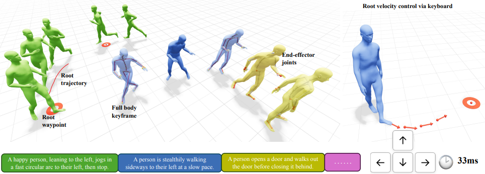

# ARDY: Autoregressive Diffusion with Hybrid Representation for Interactive Human Motion Generation

<p align="center">
  <a href="https://research.nvidia.com/labs/sil/projects/ardy/"></a>
  <a href="LICENSE"></a>
  
</p>

ARDY is an autoregressive diffusion model designed for interactive motion generation, supporting online text prompting and flexible long-horizon kinematic constraints (root paths/waypoints, full-body keyframes, and sparse joint positions/rotations) with real-time responsiveness.

This repo provides code, checkpoints, and demos to work with the pre-trained ARDY models introduced in the [SIGGRAPH paper](https://research.nvidia.com/labs/sil/projects/ardy/).

## Setup

### Low-VRAM Support (6GB+ VRAM)

* **Designed for low-VRAM systems:** Enables ARDY to run on consumer GPUs with 6GB or more of VRAM.
* **Tested hardware:** Verified on an RTX 4050 (make sure to use the latest NVIDIA drivers for TensorRT compatibility).
* **Auto-downloading Text Encoder:** Utilizes the lightweight NF4-quantized version of the text encoder, which is downloaded automatically on its first run.


In a fresh Python 3.10+ environment (conda or venv), first install a build of **PyTorch** (>= 2.4) that matches your machine's CUDA, then install ARDY in editable mode with all optional features:

```bash
conda create -n ardy python=3.11 -y
conda activate ardy
# Install PyTorch for your CUDA version first — see https://pytorch.org/get-started/locally/
# For example:
pip install torch torchvision --index-url https://download.pytorch.org/whl/cu126
pip install -e ".[all]"
pip install bitsandbytes
```

<details>
<summary>Install details: why PyTorch first, build requirements, and partial installs</summary>

- **Why install PyTorch first:** ARDY only requires `torch>=2.4`, so installing PyTorch yourself first lets you pick the CUDA build that matches your GPU/driver. The ARDY install then keeps the compatible PyTorch you already have rather than pulling a default wheel.
- **Build requirements:** the install builds the bundled motion-correction C++ extension, which requires CMake >= 3.15 and a C++17 compiler (`sudo apt install cmake build-essential` on Ubuntu).
- **Partial installs:** the optional dependency groups can also be installed individually:
  - `pip install -e .` — core model inference only
  - `pip install -e ".[demo]"` — adds the interactive demo (viser, gradio)
  - `pip install -e ".[trt]"` — adds TensorRT acceleration
- **TensorRT requirements:** the `[trt]` extra requires an NVIDIA driver >= 525 (CUDA 12-capable — the CUDA runtime itself is bundled via pip) and access to `pypi.nvidia.com` during install. On setups that don't meet these requirements, install `.[demo]` instead and select a non-TensorRT acceleration mode in the demo.

</details>


### Checkpoints

ARDY checkpoints are available trained on various skeletons with differing FPS and prediction horizon length.

> Note: models will be downloaded automatically when used in the demo, so there is no need to download them manually

| Model | Skeleton | Training Data | FPS | Horizon | Release Date | Hugging Face | License |
|:-------|:-------------|:------:|:------:|:------:|:------:|:-------------:|:-------------:|
| **ARDY-Core-RP-20FPS-Horizon40** | Core | [Bones Rigplay 1](https://bones.studio/datasets#rp01) | 20 | 40 | July 10, 2026 | [Link](https://huggingface.co/nvidia/ARDY-Core-RP-20FPS-Horizon40) | [NVIDIA Open Model](https://www.nvidia.com/en-us/agreements/enterprise-software/nvidia-open-model-agreement/) |
| **ARDY-Core-RP-20FPS-Horizon8** | Core | [Bones Rigplay 1](https://bones.studio/datasets#rp01) | 20 | 8 | July 10, 2026 | [Link](https://huggingface.co/nvidia/ARDY-Core-RP-20FPS-Horizon8) | [NVIDIA Open Model](https://www.nvidia.com/en-us/agreements/enterprise-software/nvidia-open-model-agreement/) |
| **ARDY-G1-RP-25FPS-Horizon52** | Unitree G1 | [Bones Rigplay 1](https://bones.studio/datasets#rp01) | 25 | 52 | July 10, 2026 | [Link](https://huggingface.co/nvidia/ARDY-G1-RP-25FPS-Horizon52) | [NVIDIA Open Model](https://www.nvidia.com/en-us/agreements/enterprise-software/nvidia-open-model-agreement/) |
| **ARDY-G1-RP-25FPS-Horizon8** | Unitree G1 | [Bones Rigplay 1](https://bones.studio/datasets#rp01) | 25 | 8 | July 10, 2026 | [Link](https://huggingface.co/nvidia/ARDY-G1-RP-25FPS-Horizon8) | [NVIDIA Open Model](https://www.nvidia.com/en-us/agreements/enterprise-software/nvidia-open-model-agreement/) |


**Coming soon!** We are working to train a version of ARDY on Rigplay 1 with the [SOMA body model](https://github.com/NVlabs/SOMA-X) skeleton.


## Interactive Demo

We provide an interactive demo that enables real-time humanoid character control through a combination of streaming text prompts and interactive spatial constraints. Below are some features of the interactive demo:

- Online motion generation visualized in web browser viewport
- Streaming text-to-motion
- Kinematically constrained motion generation (full body keyframes, root trajectory and waypoints, end-effector joints)
- Mouse and keyboard-based locomotion controls

### Launch Interactive Demo

```bash
python scripts/run_demo.py
```
> or 
```bash
python scripts/run_demo.py --offload
```


### Quick Start
- **Open the UI**: In your browser, go to `http://localhost:2333`. You can use Left-drag to rotate, Right-drag to pan, and Scroll to zoom to control the camera with mouse.
- **Load a model**: Choose a checkpoint from the **Model Directory** dropdown in the **Model** tab and click **Load Model**. The first load may take a few minutes if TensorRT compilation is enabled. A default checkpoint is loaded if no checkpoint is manually selected.
- **Start playback**: Press `Space` key or click **Play** button to start/stop playing the motion.
- **Text prompts**: Either click a preset in **Prompt List**, or type your own in **Prompt Text** and click **Update Text Prompt**.
- **Mouse-based locomotion control**: Press `p` to enable waypoint mode (or click the **Enable Waypoint Mode** checkbox in the **Waypoint** folder under **Generate** tab), then click in the viewport to place waypoints for locomotion control.
- **Keyboard-based velocity control**: Press `t` key to enable target-velocity control. Use arrow keys to steer: left/right rotate the direction; up/down increase or decrease the speed.
- **Kinematic constraints**: Press `z` key to sample kinematic constraints from a dataset sequence specified in **Motion file path** (in the **Constraints** folder under **Generate** tab). Use the constraint-type checkboxes to control which categories are sampled.
- **Export/load sessions**: Use the **IO** tab for basic export/load of constraints and motion.

More detailed information about the interactive demo is available in the [GUI Reference](#gui-reference) section.

### GUI Reference

<details>
<summary>Click to expand for detailed GUI usage</summary>

#### Hotkeys

| Key | Action |
|-----|--------|
| Space | Toggle play/pause |
| j | Previous frame |
| k | Next frame |
| r | Reset automatic camera to follow current frame |
| t | Toggle target velocity control and arrow key overlay |
| p | Toggle waypoint control mode |
| z | Sample kinematic constraints from specified motion file |
| Arrow keys | Control target velocity direction/speed (when target velocity control is enabled) |
| h | Show / hide keyboard shortcut overlay |

#### Tab: Playback

- **Native FPS** - The motion FPS of the loaded model.
- **Enable Auto-Replan** - If disabled, motion will not be automatically generated and stop at the last generated frame.

#### Tab: Text

- **Prompt List** - Preset prompt buttons containing example prompts. Clicking directly updates the active text prompt and embedding. You can select the text prompts on the fly and can also input your own text prompt using the **Prompt Text** field.
- **Prompt Text** - Enter a text prompt here; it will not take effect until the Update button is clicked.
- **Update Text Prompt** - Click to update the active text prompt and embedding.

#### Tab: Generate

- **Restart** - Clear all motion and restart generation from the first frame.
- **Restart From Now** - Clear motion after current frame and continue generation from the current frame.
- **Clear All Constraints** - Clear all kinematic constraints.
- **Initial Body Transform** - A gizmo to control initial root position and orientation.
- **Constraints**
  - Motion file path: path to a CSV (G1) motion file from `datasets/bones-seed/`. The kinematic constraints will be sampled from this motion file.
  - Random Motion File button: pick a random motion file from `datasets/bones-seed/` matching the loaded skeleton and populate the Motion file path field.
  - Crop to 10s: if enabled, randomly crop the loaded motion to 10 seconds if the motion is longer than 10 seconds.
  - Constraints types checkboxes [full body, hands, feet, hands+feet, 2D waypoints, 2D trajectory]: if enabled, sample constraints for the selected category.
  - Max keyframe number: maximum number of keyframe constraints allowed for sampling
  - Continue from current frame: if enabled, sample new constraints without restarting; otherwise clear motion history before generation.
  - Sample Constraints button (hotkey: `z`): If pressed, the kinematic constraints will be sampled from the specified motion file. Note that the kinematic constraints sampling only supports the G1 skeleton which is included in the Bones Seed dataset.
- **Waypoint** (mouse-based locomotion control)
  - Waypoint mode (hotkey: `p`): toggle mouse-click-based waypoint control mode
  - Dense root: if enabled, use interpolation to generate dense trajectory constraints from waypoints
  - Waypoint interval: time interval between current frame and the waypoint keyframe, measured in number of frames.
- **Target Velocity** (keyboard-based velocity control; works better with the **Over-the-shoulder** auto camera enabled)
  - Enable checkbox: enable target velocity control.
  - Target root velocity: target root velocity in XZ plane.
  - Use target heading: if enabled, use root position + orientation as constraints; if disabled, only use root position as constraints.
- **Post Process**
  - Enable Post-Processing: apply optional motion correction to reduce foot skating and improve constraint following (slower; disabled by default).
  - Root Margin: margin for root position correction.
  - Contact Threshold: threshold for foot contact detection.

#### Tab: Visualize

- **Show Foot Contacts** - Color the foot joints purple on frames where the model predicts the foot to be in contact with the ground. Only visible when **Show Skeleton** is enabled.
- **Show Hand+Foot Orientations** - Overlay rotation-axis gizmos on the hand/wrist and foot joints, for both the generated motion and any end-effector keyframes in the timeline. Useful for verifying that orientation constraints are being followed.
- **Show Reference Motion** - Display the reference motion specified in **Motion file path** as a red semi-transparent mesh character
- **Hide Distant Constraints** - If enabled, constraints outside the future cropping range specified in **Future Crop Length** are hidden
- **Auto Camera** - A dropdown list to select from three auto camera types that updates according to current frame's human body pose.

#### Tab: Model

- **Acceleration Mode** - Choose TensorRT, torch.compile, or none
- **Text Encoder** - Set device + precision for the LLM2Vec text encoder. Options: `cuda / bfloat16` (default, fastest, ~14 GB VRAM), `cuda / float32` (VRAM demanding), `cpu / bfloat16`, `cpu / float32` (slower prompt encoding but requires less VRAM).
- **TRT Export Settings** - Min/opt/max tokens and export button. These settings are used to configure the exportation of the TensorRT engines for the denoiser and decoder and may slightly affect the generation speed.
- **History Crop Length** - Maximum number of history frames input to the model (min: patch size, max: FPS x 10s - generation horizon, step size: patch size, default: min). Smaller history crop length facilitates faster adaptation to new prompts and kinematic constraints, while larger history crop length allows for longer context which helps complex semantic motion generation and smoother transitions.
- **Future Crop Length** - Number of future frames beyond generation horizon for constraint input (min: 0, max: FPS x 10s - generation horizon, step size: patch size, default: max)
- **Replan Buffer Size** - How many frames of replan buffer to use. Ensure that the generation time is less than the (replan buffer + 1) frames playback time.
- **Replan Trigger Threshold** - When remaining generated-but-unplayed frames <= this threshold, trigger replan.

#### Tab: IO

- **Session Export/Load** - Export/load the full session (motion and/or constraints) to/from a file.
- **Root Constraints** - Load/save root constraints to a file.
- **Scene** - Load a scene file and adjust mesh transform/translation.
- **Capture Viewport Image** - Capture the current viewport image and save it to a file.

</details>

### Model Integration in Demo

The interactive demo is a good reference for how ARDY can be used autoregressively for realtime applications. The key entry points are:

- **Loading:** [`load_model()`](ardy/model/load_model.py) resolves a checkpoint, builds the model, and attaches the LLM2Vec text encoder (built separately via `load_text_encoder()` so it can be reused across models). Models are referenced by nickname — a skeleton name (`"core"`, `"g1"`, `"soma"`, resolving to that skeleton's default horizon) or skeleton+horizon (`"core8"`, `"g152"`, `"soma60"`) — or by full name (`"ARDY-Core-RP-20FPS-Horizon40"`); see [`ardy/model/registry.py`](ardy/model/registry.py). The demo wires this up in [`ModelLoadingMixin.load_model`](scripts/interactive_demo/loading.py).
- **Generation:** the model runs autoregressively via [`Ardy.autoregressive_step()`](ardy/model/ardy_model.py) — text embeddings and optional kinematic constraints (`motion_mask`/`observed_motion`) in, motion frames out. See it called each step in [`GenerationMixin._generate_step`](scripts/interactive_demo/generation.py), which shows how to encode the text prompt, assemble history + constraint masks, and decode the output back to joint positions with `motion_rep.inverse(...)`.

---

## Command-Line Generation

For non-interactive / batch generation, [`scripts/generate.py`](scripts/generate.py) generates motion from a text prompt and writes it to disk (`.npz`; plus a MuJoCo-qpos `.csv` for G1). Generated files are written to the `outputs/` folder by default.

```bash
# Simplest: 5s of motion with the default model, written to outputs/output.npz
python scripts/generate.py "A person walks in a circle."

# Choose a model + length, and fix the seed for reproducible output (writes outputs/jump.npz)
python scripts/generate.py "A person jumps." --model core --duration 8.0 --seed 0 --output jump

# Multiple samples (writes a folder outputs/waves/ with waves_00.npz, waves_01.npz, ...)
python scripts/generate.py "A person waves." --model g1 --num_samples 4 --output waves
```

Each `.npz` contains the generated motion — `posed_joints` (world-space joint positions, `[T, J, 3]`), local/global joint rotations, root positions, and foot contacts — plus the `fps` and the prompt `text`.

To play back a generated motion in the browser (same viser viewport as the interactive demo), use [`scripts/visualize.py`](scripts/visualize.py):

```bash
python scripts/visualize.py outputs/output.npz   # single file
python scripts/visualize.py outputs/waves        # folder written with --num_samples > 1
```

then open `http://localhost:2334`. The skeleton (core / g1 / soma) is detected from the file; the viewer offers play/pause, a frame slider, mesh/skeleton toggles, and a sample dropdown for multi-sample folders.

Most useful flags:

| Flag | Meaning |
|------|---------|
| `--model` | Model nickname `core`/`g1` (optionally with horizon, e.g. `core8`) or full folder name. Default: `core`. |
| `--duration` | Length in seconds (default 5.0). |
| `--num_samples` | Number of samples; when >1, writes a numbered folder. |
| `--seed` | Fix the random seed for reproducible output. |
| `--output` | Output stem (single sample → one file; multiple → a folder). Bare names go under `outputs/`; pass a path (e.g. `results/jump`) to write elsewhere. |
| `--history_frames` | History visible to each autoregressive step. Default: the longest history fitting the model's trained 10s window — keep it unless you want faster prompt adaptation. |
| `--constraints` | Path to a saved kinematic-constraint list. |
| `--no-postprocess` | Don't apply motion post-processing to reduce foot skating and hit constraints. |


## Citation

If you use this code in your research, please cite:

```bibtex
@article{zhao2026ardy,
  title   = {ARDY: Autoregressive Diffusion with Hybrid Representation for Interactive Human Motion Generation},
  author  = {Zhao, Kaifeng and Petrovich, Mathis and Zhang, Haotian and Wang, Tingwu and Tang, Siyu and Rempe, Davis},
  journal = {ACM Transactions on Graphics (TOG)},
  year    = {2026},
  volume  = {45},
  number  = {4},
  articleno = {86},
  doi     = {10.1145/3811284}
}
```

## License

This codebase is licensed under [Apache-2.0](LICENSE). Note that model checkpoints and data are licensed separately as indicated on the HuggingFace download pages.

This project will download and install additional third-party open source software projects. Review the license terms of these open source projects before use.

## Acknowledgments

This project builds upon excellent open-source projects:
- [Viser](https://github.com/nerfstudio-project/viser) for interactive 3D motion generation demo
- [LLM2Vec](https://github.com/McGill-NLP/llm2vec) for text encoding

## Contact

For questions or issues, please open an issue on this repository or reach out directly to the authors.

---
